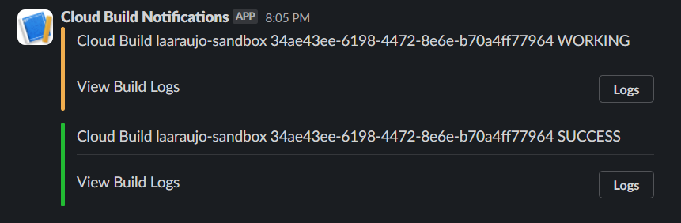

# Cloud Build Slack notifications

Get slack notifications whenever there's a Cloud Build update.




## Table of contents

* [Pre-requisites](#pre-requisites)
* [Installation](#installation)
* [Configuration](#configuration)
* [Manual Deployment](#manual-deployment)
* [Sources](#sources)

## Pre-requisites

1. [Slack App](https://api.slack.com/apps)
2. [Webhook URL](https://api.slack.com/messaging/webhooks) for the app above


## Installation

1. Clone this repository
```sh
git clone git@github.com:laaraujo/cloud-build-slack-notifications.git
```

2. Change directory to the terraform folder
```sh
cd terraform
```

3. Install Terraform providers and dependencies
```sh
terraform init
```


## Configuration

### [For manual deployment](#manual-deployment)
Sample `terraform.tfvars`:
```sh
project_id = "<gcp_project_id>"
region = "<gcp_region>"
zone = "<gcp_zone>"
slack_app_webhook_url = "<slack_app_webhook_url>"
```


## Manual deployment

These instructions assume you already have:
* [Terraform]() installed
* [GCP Credentials configured locally](https://cloud.google.com/docs/authentication/provide-credentials-adc)

1. Check the what the `terraform plan` looks like:
```sh
terraform plan
```

2. If the output above looks good, go ahead and apply those changes (you will be prompted to confirm with **"yes"**):
```sh
terraform apply
```


## Sources

* [Configuring Slack Notifications](https://cloud.google.com/build/docs/configuring-notifications/configure-slack)
* [GCP Cloud Build API](https://cloud.google.com/build/docs/api/reference/rest/v1/projects.builds) for customizing notifier behavior in [config.yml](./files/config.yml)
* [Slack API Block Kit](https://api.slack.com/block-kit) for customizing slack message in [template.json](./files/template.json)
* [Cloud Build Slack Notifier docker image](https://github.com/GoogleCloudPlatform/cloud-build-notifiers/tree/master/slack)


## License

This project is licensed under the MIT License - see the [LICENSE](LICENSE) file for details.
